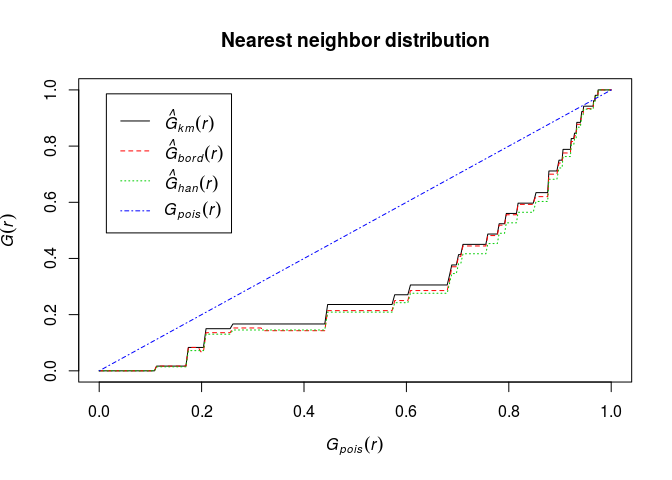
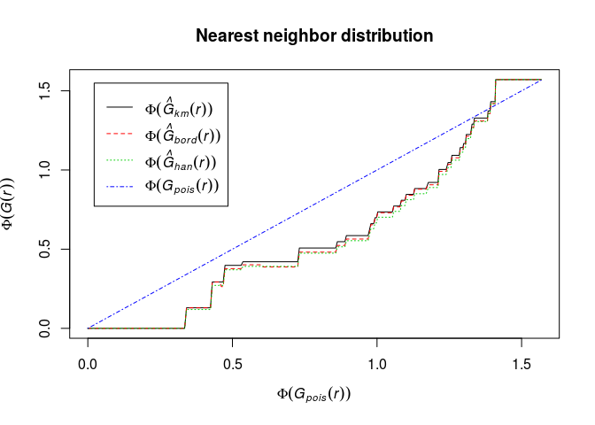
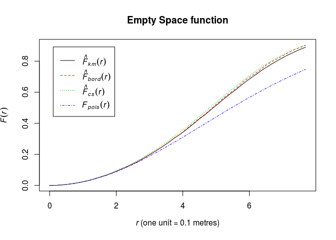
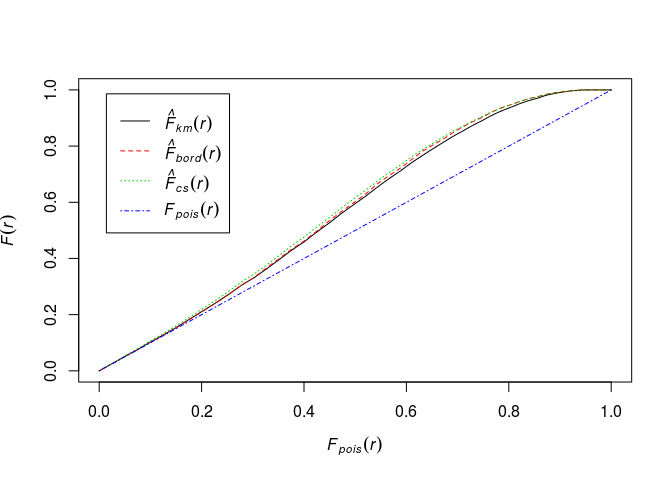
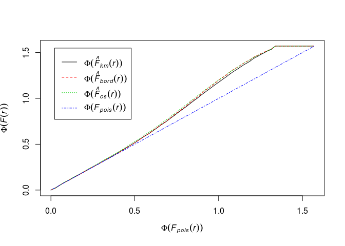

Lab 8: Spacing and distances
================

This session is concerned with summary statistics for spacings and interpoint distances.
The lecturer's R script is [available here](https://raw.githubusercontent.com/spatstat/Melb2018/master/Scripts/script08.R) (right click and save).

``` r
library(spatstat)
```

### Exercise 1

For the `swedishpines` data:

1.  Calculate the estimate of the nearest neighbour distance distribution function *G* using `Gest`.

    ``` r
    G <- Gest(swedishpines)
    ```

2.  Plot the estimate of *G*(*r*) against *r*

    ``` r
    plot(G, cbind(km, rs, han) ~ r, main = "Nearest neighbor distance distribution")
    ```

    

3.  Plot the estimate of *G*(*r*) against the theoretical (Poisson) value *G*<sub>pois</sub>(*r*)=1 − exp(−*λ**π**r*<sup>2</sup>).

    E.g.

    ``` r
    plot(G, . ~ theo, main = "Nearest neighbor distribution")
    ```

    

4.  Define Fisher’s variance-stabilising transformation for c.d.f.’s by

    ``` r
    Phi <- function(x) asin(sqrt(x))
    ```

    Plot the *G* function using the formula `Phi(.) ~ Phi(theo)` and interpret it.

    ``` r
    Phi <- function(x) asin(sqrt(x))
    plot(G, Phi(.) ~ Phi(theo), main = "Nearest neighbor distribution")
    ```

    

    The transformation has made the deviations from CSR in the central part of the curve smaller. We need envelopes to say anything about significance.

### Exercise 2

For the `swedishpines` data:

1.  Calculate the estimate of the nearest neighbour distance distribution function *F* using `Fest`.

    ``` r
    Fhat <- Fest(swedishpines)
    ```

2.  Plot the estimate of *F*(*r*) against *r*

    ``` r
    plot(Fhat, main = "Empty Space function")
    ```

    

3.  Plot the estimate of *F*(*r*) against the theoretical (Poisson) value *F*<sub>pois</sub>(*r*)=1 − exp(−*λ**π**r*<sup>2</sup>).

    ``` r
    plot(Fhat, . ~ theo, main = "")
    ```

    

4.  Define Fisher’s variance-stabilising transformation for c.d.f.’s by

    ``` r
    Phi <- function(x) asin(sqrt(x))
    ```

    Plot the *F* function using the formula `Phi(.) ~ Phi(theo)` and interpret it.

    ``` r
    Phi <- function(x) asin(sqrt(x))
    plot(Fhat, Phi(.) ~ Phi(theo), main = "")
    ```

    

    The transformation has changed the picture much. It looks like deviation from CSR, but again, without envelopes it's hard to draw conclusions.
